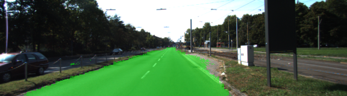
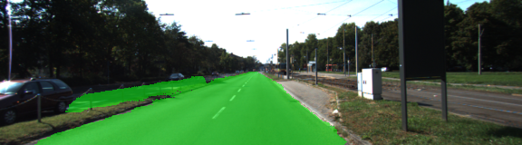
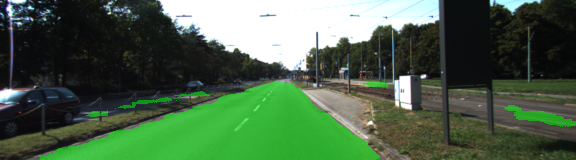
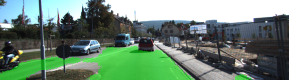
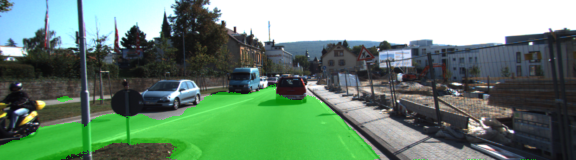
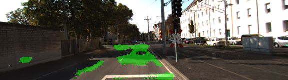
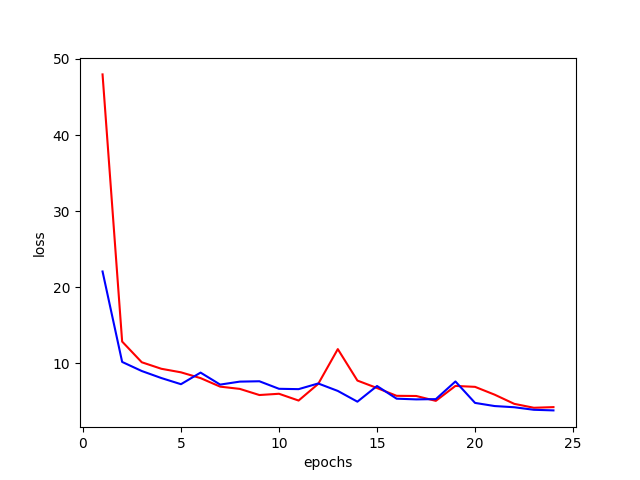

# CarND-Semantic-Segmentation
Self-Driving Car Engineer Nanodegree Program
   
### Goals

The goal of this project is to train a deep neural network to do semantic segmentation, an image classification task that assigns every pixel in the image to a class. This is an important task for autonomous vehicles, because it can allow precise identification of the roadway, vehicles, pedestrians and other objects encountered while driving. 

### Solution

An extremely powerful DNN architure for semantic segmentation is a fully convolutional network (FCN), which combines a down-sampling "encoder" front half with an upsampling "decoder" back half. I used [FCN-8](https://people.eecs.berkeley.edu/~jonlong/long_shelhamer_fcn.pdf), which uses VGG16 as the encoder. The final VGG16 layer is connected to a 1x1 convolutional layer, and then a series of transposed convolutional layers with skip connections (element-wise addition) from previous layers in VGG16. L2 regularization helps reduce overfitting.

This architecture allows semantic information that is derived from the convolution and pooling operations to be combined with spatial location information from the skip connections, giving the network the ability to combine classification and location.

### Results

With hyperparameters [epochs,batch_size,keep_prob,learning_rate] = [12,5,0.5,0.001], the network successfully trains on the KITTI dataset (see below for a sample image). Overall it's quite successful, although it struggles with some situations, such as shadows on the road.

To try to improve this, I added data augmentation in the form of left-right image flips, using numpy's fliplr() function (added in get_batches_fn() in helper.py). For the same hyperparameters, this didn't significantly affect the loss. Unfortunately, it appears to give worse predictions for a handful of examples. The next step for improving the network accuracy is probably to simply train for more epochs, and then investigate other data-augmentation methods such as noise addition and brightness variation.

6 epochs                           | 24 epochs                          | 24 epochs with augmentation        | Notes
:----------------------------------:|:----------------------------------:|:----------------------------------:|:-------------------:
         |      |  | Good performance
         |      |  | Sidewalk confusion
         |      |  | Shadow confusion



ABOVE: Training loss (red = original, blue = data augmentation)

### Setup Information
##### GPU
`main.py` will check to make sure you are using GPU - if you don't have a GPU on your system, you can use AWS or another cloud computing platform.
##### Frameworks and Packages
Make sure you have the following is installed:
 - [Python 3](https://www.python.org/)
 - [TensorFlow](https://www.tensorflow.org/)
 - [NumPy](http://www.numpy.org/)
 - [SciPy](https://www.scipy.org/)

You may also need [Python Image Library (PIL)](https://pillow.readthedocs.io/) for SciPy's `imresize` function.

##### Dataset
Download the [Kitti Road dataset](http://www.cvlibs.net/datasets/kitti/eval_road.php) from [here](http://www.cvlibs.net/download.php?file=data_road.zip).  Extract the dataset in the `data` folder.  This will create the folder `data_road` with all the training a test images.

### Start
##### Implement
Implement the code in the `main.py` module indicated by the "TODO" comments.
The comments indicated with "OPTIONAL" tag are not required to complete.
##### Run
Run the following command to run the project:
```
python main.py
```
**Note:** If running this in Jupyter Notebook system messages, such as those regarding test status, may appear in the terminal rather than the notebook.

#### Example Outputs
Here are examples of a sufficient vs. insufficient output from a trained network:

Sufficient Result          |  Insufficient Result
:-------------------------:|:-------------------------:
  |  

### Submission
1. Ensure you've passed all the unit tests.
2. Ensure you pass all points on [the rubric](https://review.udacity.com/#!/rubrics/989/view).
3. Submit the following in a zip file.
 - `helper.py`
 - `main.py`
 - `project_tests.py`
 - Newest inference images from `runs` folder  (**all images from the most recent run**)
 
### Tips
- The link for the frozen `VGG16` model is hardcoded into `helper.py`.  The model can be found [here](https://s3-us-west-1.amazonaws.com/udacity-selfdrivingcar/vgg.zip).
- The model is not vanilla `VGG16`, but a fully convolutional version, which already contains the 1x1 convolutions to replace the fully connected layers. Please see this [post](https://s3-us-west-1.amazonaws.com/udacity-selfdrivingcar/forum_archive/Semantic_Segmentation_advice.pdf) for more information.  A summary of additional points, follow. 
- The original FCN-8s was trained in stages. The authors later uploaded a version that was trained all at once to their GitHub repo.  The version in the GitHub repo has one important difference: The outputs of pooling layers 3 and 4 are scaled before they are fed into the 1x1 convolutions.  As a result, some students have found that the model learns much better with the scaling layers included. The model may not converge substantially faster, but may reach a higher IoU and accuracy. 
- When adding l2-regularization, setting a regularizer in the arguments of the `tf.layers` is not enough. Regularization loss terms must be manually added to your loss function. otherwise regularization is not implemented.

### Why Layer 3, 4 and 7?
In `main.py`, you'll notice that layers 3, 4 and 7 of VGG16 are utilized in creating skip layers for a fully convolutional network. The reasons for this are contained in the paper [Fully Convolutional Networks for Semantic Segmentation](https://arxiv.org/pdf/1605.06211.pdf).

In section 4.3, and further under header "Skip Architectures for Segmentation" and Figure 3, they note these provided for 8x, 16x and 32x upsampling, respectively. Using each of these in their FCN-8s was the most effective architecture they found. 

### Optional sections
Within `main.py`, there are a few optional sections you can also choose to implement, but are not required for the project.

1. Train and perform inference on the [Cityscapes Dataset](https://www.cityscapes-dataset.com/). Note that the `project_tests.py` is not currently set up to also unit test for this alternate dataset, and `helper.py` will also need alterations, along with changing `num_classes` and `input_shape` in `main.py`. Cityscapes is a much more extensive dataset, with segmentation of 30 different classes (compared to road vs. not road on KITTI) on either 5,000 finely annotated images or 20,000 coarsely annotated images.
2. Add image augmentation. You can use some of the augmentation techniques you may have used on Traffic Sign Classification or Behavioral Cloning, or look into additional methods for more robust training!
3. Apply the trained model to a video. This project only involves performing inference on a set of test images, but you can also try to utilize it on a full video.
 
### Using GitHub and Creating Effective READMEs
If you are unfamiliar with GitHub , Udacity has a brief [GitHub tutorial](http://blog.udacity.com/2015/06/a-beginners-git-github-tutorial.html) to get you started. Udacity also provides a more detailed free [course on git and GitHub](https://www.udacity.com/course/how-to-use-git-and-github--ud775).

To learn about REAMDE files and Markdown, Udacity provides a free [course on READMEs](https://www.udacity.com/courses/ud777), as well. 

GitHub also provides a [tutorial](https://guides.github.com/features/mastering-markdown/) about creating Markdown files.
